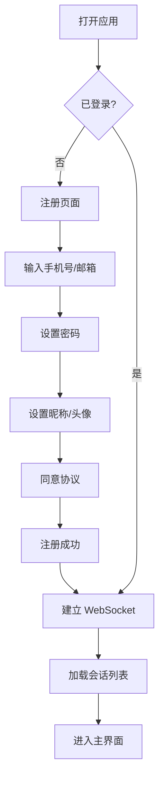
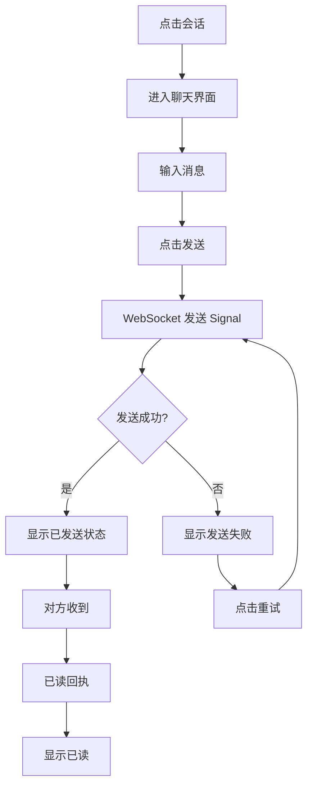
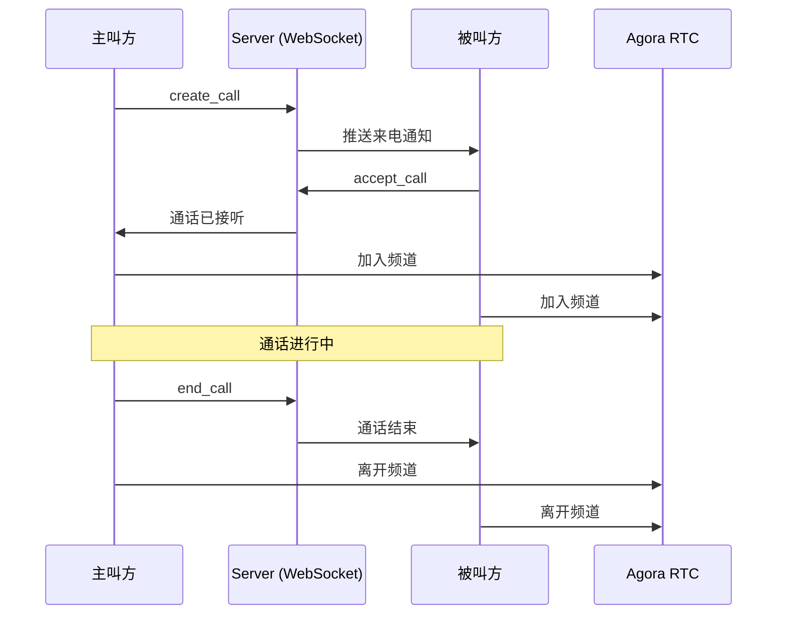

# 产品需求文档（PRD）
## 99chat — 即时通讯 PWA 产品

| 项目 | 内容 |
|---|---|
| 产品名称 | 99chat |
| 产品类型 | PWA 即时通讯 Web 应用 |
| 文档版本 | v1.0 |
| 更新日期 | 2026-08-30 |
| 产品定位 | 轻量级、可安装、跨平台的即时通讯应用，支持单聊、群聊、音视频通话 |

---

## 1. 产品概述

### 1.1 产品愿景

> "Let's talk." — 让沟通简单、即时、无处不在。

### 1.2 目标用户

- 需要轻量级 IM 解决方案的社群 / 小团队
- 希望通过浏览器即可使用、无需下载 App 的用户
- 需要私有化部署 IM 能力的企业

### 1.3 核心价值

| 价值点 | 说明 |
|---|---|
| 零安装 | 通过浏览器直接使用，支持"添加到主屏幕"安装为 PWA |
| 全平台 | 一套代码适配桌面、平板、手机 |
| 实时通信 | WebSocket 长连接，消息毫秒级触达 |
| 端到端安全 | 消息加密传输，本地 WASM 加密存储 |
| 音视频通话 | 一对一音视频通话，支持多设备联动 |
| 开源底座 | 基于 OpenIM 开源框架，可私有化部署 |

---

## 2. 用户角色定义

| 角色 | 权限说明 |
|---|---|
| 普通用户 | 注册/登录、单聊、群聊、通讯录管理、音视频通话、个人设置 |
| 群主 | 创建群组、邀请/移除成员、任命管理员、设置群信息、解散群组 |
| 群管理员 | 邀请/移除成员（非群主/管理员）、审批入群申请、发布群公告、全员禁言 |
| 系统管理员 | 后台用户管理、消息审计、系统配置（非本 PWA 范围） |

---

## 3. 功能模块详述

### 3.1 账号与认证

#### 3.1.1 用户注册

- 支持手机号 / 邮箱注册
- 注册后需设置昵称和头像
- 支持邀请码注册（可选）

#### 3.1.2 用户登录

- 账号密码登录
- 支持 Token 自动续期（`UpdateWebUserToken`）
- 多设备同时登录，支持远程踢出（`LetLogout`）
- 登录后建立 WebSocket 长连接

#### 3.1.3 密码找回

- 通过手机号 / 邮箱验证码重置密码

#### 3.1.4 账号切换

- 支持多账号切换，无需退出当前账号

#### 3.1.5 用户协议

- 注册时展示用户协议和隐私政策

---

### 3.2 消息模块

#### 3.2.1 会话列表

| 功能 | 说明 |
|---|---|
| 会话展示 | 按最近消息时间排序，显示头像、名称、最后一条消息摘要、时间、未读数 |
| 会话搜索 | 支持按名称 / 内容搜索会话 |
| 会话置顶 | 支持置顶 / 取消置顶（`IsPinned`） |
| 免打扰 | 支持开启 / 关闭免打扰（`IsNotDisturb`） |
| 未读计数 | 实时更新未读消息数，角标显示 |
| 滑动操作 | 左滑显示置顶 / 删除按钮 |
| 长按菜单 | 长按显示上下文菜单（置顶、免打扰、删除） |
| 在线状态 | 会话头像旁显示在线 / 离线指示点 |

#### 3.2.2 聊天界面

| 功能 | 说明 |
|---|---|
| 消息气泡 | 区分发送 / 接收方向，左右分列 |
| 消息时间 | 智能时间显示（今天显示时分，昨天显示"昨天"，更早显示日期） |
| 消息类型 | 文本、图片、语音、视频、文件、名片、表情、通知 |
| 富文本 | 支持 Quill 富文本编辑 |
| 消息发送状态 | 发送中 → 已发送 → 已送达 → 已读 |
| 消息撤回 | 支持撤回指定时间内的消息 |
| 消息删除 | 支持删除单条消息（仅本地删除） |
| 消息引用回复 | 支持引用某条消息进行回复 |
| 消息转发 | 支持批量选择消息转发到其他会话 |
| 消息复制 | 复制文本消息内容 |
| 已读回执 | 单聊已读（`ReadChat`）、自身已读同步（`ReadChatSelf`）、群聊已读（`ReadGroupChat`） |
| 消息搜索 | 会话内搜索历史消息 |

#### 3.2.3 消息类型详情

| 类型 | 说明 | 存储 |
|---|---|---|
| 文本 Text | 纯文本消息 | 直接存储 |
| 图片 Image | 支持发送图片，自动压缩 / 生成缩略图 | S3 / MinIO |
| 语音 Audio | 录音发送，支持播放时长显示 | S3 / MinIO |
| 视频 Video | 视频发送，FFmpeg.wasm 浏览器端处理 / 生成缩略图 | S3 / MinIO |
| 文件 File | 任意格式文件传输 | S3 / MinIO |
| 名片 Contact | 发送联系人名片 | 引用用户 ID |
| 表情 Emoticon | 发送自定义表情包 | 引用表情 ID |
| 通知 Notice | 系统通知消息（入群 / 退群等） | 系统生成 |
| 通话 Call | 通话记录消息 | 系统生成 |
| 邀请 Invite | 群邀请消息 | 系统生成 |

#### 3.2.4 群聊

| 功能 | 说明 |
|---|---|
| 群消息 | 群内实时消息收发 |
| @提及 | 支持 @单人、@所有人（`AtIDs`） |
| 群公告 | 群主 / 管理员发布群公告 |
| 入群通知 | 新成员入群时发送系统通知（`JoinGroup`） |
| 退群通知 | 成员退群时发送系统通知（`LeaveGroup`） |
| 全员禁言 | 群主 / 管理员开启全员禁言（`AllBan` / `BanGroupUser`） |
| 群消息撤回 | 群主 / 管理员可撤回他人消息 |
| 群消息已读 | 群消息已读状态同步（`ReadGroupChat`） |

---

### 3.3 通讯录模块

#### 3.3.1 好友管理

| 功能 | 说明 |
|---|---|
| 好友列表 | 按字母 / 分组展示好友 |
| 添加好友 | 通过搜索用户 ID / 手机号添加 |
| 好友请求 | 发送 / 接收 / 接受 / 拒绝好友申请（`FriendApplication`） |
| 好友申请列表 | 查看所有待处理的好友申请 |
| 删除好友 | 从好友列表中移除 |
| 好友备注 | 设置 / 修改好友备注名 |
| 黑名单 | 拉黑 / 解除拉黑用户 |

#### 3.3.2 二维码

| 功能 | 说明 |
|---|---|
| 我的名片 | 生成个人二维码，支持分享 |
| 扫一扫 | 扫描二维码添加好友 / 加入群组 |
| 分享名片 | 将好友名片分享给他人 |

#### 3.3.3 标签管理

| 功能 | 说明 |
|---|---|
| 创建标签 | 为联系人创建自定义标签 |
| 标签分组 | 按标签筛选 / 查看联系人 |
| 添加成员 | 将联系人加入标签 |

#### 3.3.4 群组管理

| 功能 | 说明 |
|---|---|
| 群组列表 | 展示所有已加入的群组 |
| 创建群组 | 选择好友创建新群 |
| 群资料 | 群名称、群头像、群简介、群公告 |
| 群成员 | 查看群成员列表、成员角色 |
| 群权限 | 群主 > 管理员 > 普通成员三级权限 |
| 添加管理员 | 群主任命管理员 |
| 入群申请 | 申请加入群组（`GroupApplyJoin`） |
| 入群审批 | 管理员审批入群申请 |
| 邀请入群 | 群成员邀请好友入群 |
| 退出群组 | 成员主动退群 |
| 解散群组 | 群主解散群组 |

---

### 3.4 音视频通话

#### 3.4.1 通话功能

| 功能 | 说明 |
|---|---|
| 一对一语音通话 | 实时语音通话 |
| 一对一视频通话 | 实时视频通话 |
| 通话信令 | 通过 WebSocket Signal 传递通话控制命令 |
| 通话记录 | 通话结束后生成通话记录消息 |

#### 3.4.2 通话流程

```
主叫方                          被叫方
  │                               │
  ├─ create_call ──────────────→  │  收到来电
  │                               │  (振铃)
  │                               │
  │  ←──── accept_call ──────────┤  接听
  │                               │
  │  通话中（Agora RTC）          │
  │                               │
  ├─ end_call ──────────────────→ │  结束
  │                               │
  │  通话记录消息                  │
```

#### 3.4.3 通话状态

| 状态 | 说明 |
|---|---|
| create_call | 发起通话 |
| accept_call | 被叫接听 |
| refuse_call | 被叫拒绝 |
| cancel_call | 主叫取消（对方未接听前） |
| end_call | 通话结束 |
| busy_call | 被叫忙线中 |
| timeout_call | 无人接听超时 |
| accept_call_on_other_device | 在其他设备已接听 |
| refuse_call_on_other_device | 在其他设备已拒绝 |

---

### 3.5 个人设置

#### 3.5.1 个人资料

| 功能 | 说明 |
|---|---|
| 头像 | 上传 / 更换头像 |
| 昵称 | 修改昵称 |
| 个人签名 | 设置个性签名 |
| 二维码名片 | 生成 / 展示个人二维码 |

#### 3.5.2 账号设置

| 功能 | 说明 |
|---|---|
| 修改密码 | 修改登录密码 |
| 账号切换 | 切换到其他账号 |
| 退出登录 | 退出当前账号 |

#### 3.5.3 通用设置

| 功能 | 说明 |
|---|---|
| 消息通知 | 开启 / 关闭消息通知 |
| 深色模式 | 跟随系统 / 手动切换 |
| 语言 | 多语言切换（i18next） |
| 字体大小 | 调整消息字体大小 |

#### 3.5.4 隐私与安全

| 功能 | 说明 |
|---|---|
| 黑名单管理 | 查看 / 移除黑名单 |
| 加密存储 | 本地 WASM 加密存储 |
| 在线状态隐私 | 控制是否向他人显示在线状态 |

---

### 3.6 PWA 特性

| 特性 | 说明 |
|---|---|
| 可安装 | 支持添加到主屏幕，全屏启动 |
| 离线访问 | Service Worker 缓存核心资源 |
| 推送通知 | FCM 推送，离线消息触达 |
| 启动画面 | 适配 iPhone 5SE ~ iPhone 14 Pro Max 全尺寸 splash screen |
| 状态栏 | 黑色状态栏样式 |

---

### 3.7 开发者工具

| 功能 | 说明 |
|---|---|
| 消息调试 | 手动发送测试消息 |
| 日志查看 | 查看客户端运行日志 |
| 用户反馈 | 提交问题反馈 |
| 调试面板 | DevTools 开发者面板 |

---

## 4. 非功能性需求

### 4.1 性能

| 指标 | 目标 |
|---|---|
| 消息延迟 | 消息发送到接收 < 500ms |
| 首屏加载 | < 3 秒（CDN 加速） |
| WebSocket 连接 | < 1 秒建立 |
| 并发支持 | 单节点 10 万 WebSocket 连接 |
| 群组上限 | 单群 10,000 成员 |

### 4.2 安全

| 要求 | 说明 |
|---|---|
| 传输加密 | HTTPS + WSS |
| 消息加密 | 端到端加密（CryptoJS） |
| 本地存储 | WASM SQLite 加密存储 |
| Token 安全 | JWT Token + 自动续期 |
| HSTS | 强制 HTTPS |

### 4.3 兼容性

| 平台 | 要求 |
|---|---|
| Chrome / Edge | 90+ |
| Safari | 14+ |
| Firefox | 90+ |
| iOS Safari | 14+（PWA 安装） |
| Android Chrome | 90+（PWA 安装） |
| 响应式 | 320px ~ 2560px |

### 4.4 可用性

| 要求 | 说明 |
|---|---|
| 服务可用性 | 99.9% |
| 消息可靠投递 | 不丢消息、不重复、有序 |
| 离线消息 | 上线后自动同步离线消息 |

---

## 5. 用户流程图

### 5.1 注册 → 首次使用流程



### 5.2 发送消息流程



### 5.3 音视频通话流程



---

## 6. 信息架构（站点地图）

```
99chat
├── 认证
│   ├── 登录
│   ├── 注册
│   ├── 忘记密码
│   ├── 账号切换
│   └── 用户协议
├── 首页
├── 消息
│   ├── 会话列表
│   ├── 会话详情
│   │   ├── 单聊
│   │   └── 群聊
│   ├── 群管理
│   │   ├── 群信息
│   │   ├── 群成员
│   │   ├── 管理员列表
│   │   ├── 添加管理员
│   │   ├── 入群申请
│   │   └── 群设置
│   ├── 通话页面
│   ├── 媒体查看
│   └── 消息转发
├── 通讯录
│   ├── 好友列表
│   ├── 用户详情
│   ├── 群组列表
│   ├── 创建群组
│   ├── 好友请求
│   │   ├── 用户请求
│   │   ├── 群请求
│   │   ├── 扫一扫
│   │   └── 分享名片
│   ├── 标签管理
│   │   └── 添加标签成员
│   └── 好友申请列表
├── 个人设置
│   ├── 个人资料
│   ├── 账号设置
│   ├── 通用设置
│   ├── 隐私与安全
│   └── 关于我们
└── 开发者工具
    ├── 消息调试
    ├── 日志
    └── 反馈
```

---

## 7. 数据模型（产品视角）

### 7.1 用户 User

| 字段 | 类型 | 说明 |
|---|---|---|
| UserID | string | 唯一用户 ID |
| Nickname | string | 昵称 |
| FaceURL | string | 头像 URL |
| Gender | int | 性别（0 未知 / 1 男 / 2 女） |
| PhoneNumber | string | 手机号 |
| Email | string | 邮箱 |
| Birth | string | 生日 |
| Signature | string | 个人签名 |
| IsOnline | bool | 在线状态 |

### 7.2 会话 ConversationSession

| 字段 | 类型 | 说明 |
|---|---|---|
| ChatSessionID | string | 会话 ID |
| UserID | string | 对方用户 ID（单聊） |
| GroupID | string | 群 ID（群聊） |
| LastMsgTimeStamp | int | 最后消息时间戳 |
| LastMsgType | string | 最后消息类型 |
| LastMsg | string | 最后消息内容摘要 |
| AtIDs | []string | @提及的用户 ID 列表 |
| IsNotDisturb | bool | 是否免打扰 |
| IsPinned | bool | 是否置顶 |

### 7.3 消息 Message

| 字段 | 类型 | 说明 |
|---|---|---|
| MsgID | string | 消息唯一 ID |
| SendID | string | 发送者 ID |
| RecvID | string | 接收者 ID（单聊） / 群 ID（群聊） |
| MsgType | string | 消息类型（Text/Image/Audio/...） |
| Content | string | 消息内容 |
| TimeStamp | int | 发送时间戳 |
| IsRead | bool | 是否已读 |
| Seq | int | 消息序列号 |

### 7.4 群组 Group

| 字段 | 类型 | 说明 |
|---|---|---|
| GroupID | string | 群唯一 ID |
| GroupName | string | 群名称 |
| FaceURL | string | 群头像 |
| Introduction | string | 群简介 |
| Announcement | string | 群公告 |
| OwnerUserID | string | 群主 ID |
| MemberCount | int | 成员数 |
| CreateTime | int | 创建时间 |

### 7.5 群成员 GroupMember

| 字段 | 类型 | 说明 |
|---|---|---|
| GroupID | string | 群 ID |
| UserID | string | 用户 ID |
| RoleLevel | int | 角色（100 群主 / 60 管理员 / 20 成员） |
| JoinTime | int | 加入时间 |
| Nickname | string | 群昵称 |
| FaceURL | string | 成员头像 |
| MuteEndTime | int | 禁言结束时间 |

### 7.6 好友关系 Friend

| 字段 | 类型 | 说明 |
|---|---|---|
| OwnerUserID | string | 所属用户 ID |
| FriendUserID | string | 好友用户 ID |
| Remark | string | 备注 |
| CreateTime | int | 成为好友时间 |
| IsBlack | bool | 是否拉黑 |

---

## 8. 版本规划

### v1.0（MVP）
- ✅ 用户注册 / 登录 / 密码找回
- ✅ 单聊 / 群聊（文本、图片、语音、视频、文件）
- ✅ 通讯录（好友管理、群组管理）
- ✅ 一对一音视频通话
- ✅ PWA 安装 + 离线 + 推送
- ✅ 消息已读回执、撤回、转发
- ✅ 多语言支持

### v1.5（计划）
- 🔲 群音视频通话
- 🔲 消息表情包自定义
- 🔲 聊天文件管理器
- 🔲 消息搜索增强（全文搜索）
- 🔲 桌面端通知优化

### v2.0（计划）
- 🔲 频道 / 广播功能
- 🔲 机器人 API
- 🔲 端到端加密（E2EE）
- 🔲 多端消息同步增强
- 🔲 管理后台

---

*文档结束*
