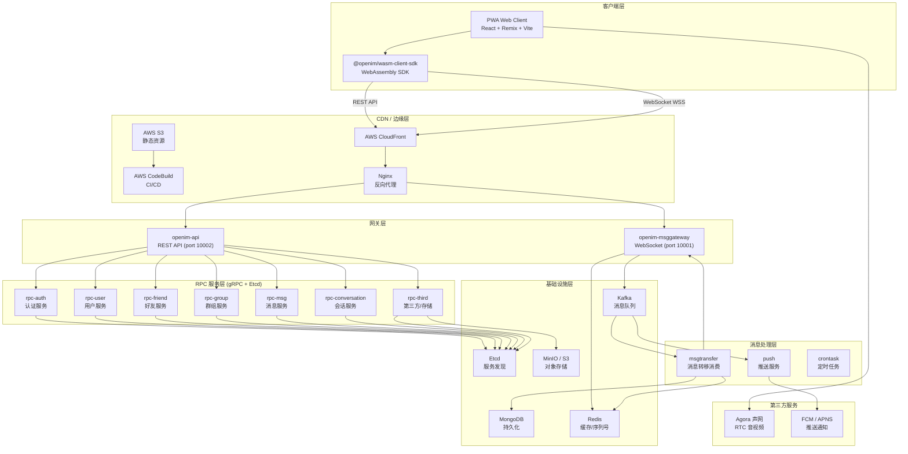
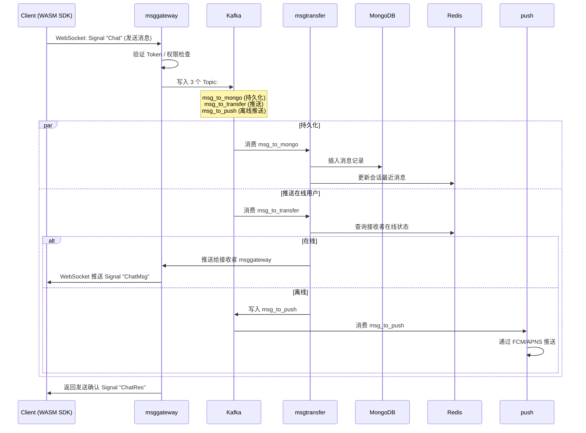
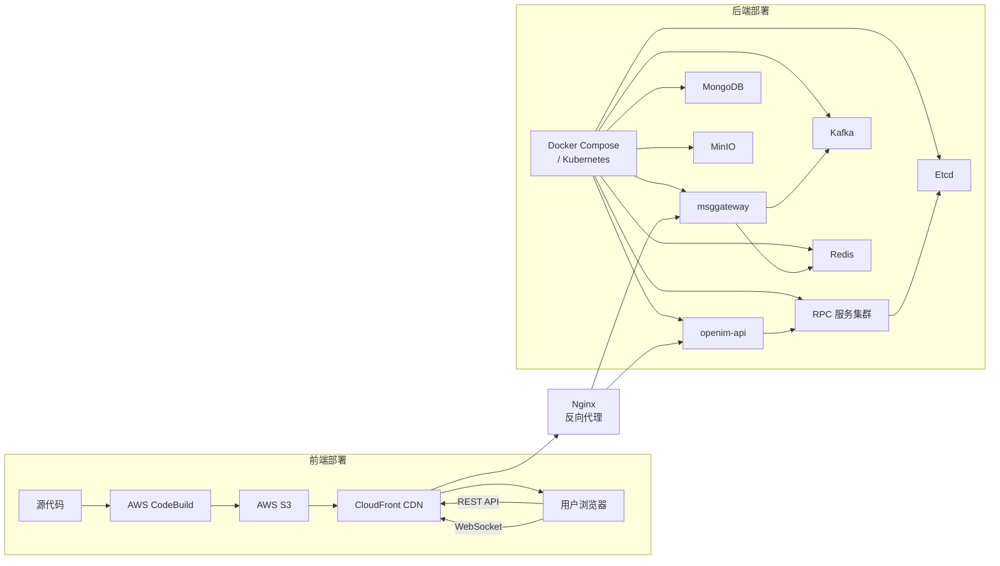
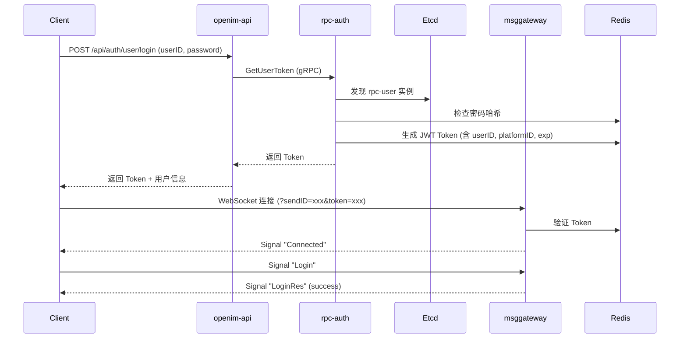

# 技术架构设计文档（TDD）
## 99chat — 即时通讯 PWA 系统

| 项目 | 内容 |
|---|---|
| 系统名称 | 99chat |
| 底层平台 | OpenIM |
| 文档版本 | v1.0 |
| 更新日期 | 2026-08-30 |

---

## 1. 系统架构总览

### 1.1 架构全景图



### 1.2 技术选型一览

| 层级 | 技术选型 | 版本 / 说明 |
|---|---|---|
| **前端框架** | React | 18.x |
| **元框架** | Remix（React Router v7） | SSR/SSG + 客户端路由 |
| **构建工具** | Vite | 代码分割 + modulepreload |
| **状态管理** | Zustand + Immer | 轻量级全局状态 |
| **样式方案** | Tailwind CSS | 原子化 CSS |
| **图标库** | Iconsax | SVG 图标组件 |
| **富文本** | Quill | 消息编辑器 |
| **视频处理** | FFmpeg.wasm | 浏览器端视频转码 |
| **加密** | CryptoJS | AES 加密 |
| **国际化** | i18next | 多语言 |
| **动画** | Motion（Framer Motion） | 过渡动画 |
| **工具库** | Lodash | 函数工具 |
| **字体** | Noto Sans SC + Roboto Mono | 中文 + 等宽 |
| **IM SDK** | @openim/wasm-client-sdk | WebAssembly 本地 SQLite |
| **音视频** | Agora RTC Web SDK | 一对一音视频 |
| **推送** | Firebase Cloud Messaging | Web Push |
| **后端语言** | Go | OpenIM Server |
| **通信协议** | gRPC + WebSocket | 服务间 / 客户端通信 |
| **数据库** | MongoDB | 文档型持久化 |
| **缓存** | Redis | 序列号 / 会话 / 在线状态 |
| **消息队列** | Kafka | 异步解耦 |
| **服务发现** | Etcd | RPC 服务注册 |
| **对象存储** | MinIO / S3 | 媒体文件 |
| **CDN** | AWS CloudFront | 全球加速 |
| **CI/CD** | AWS CodeBuild | 自动构建部署 |

---

## 2. 前端架构

### 2.1 项目结构

```
src/
├── main.tsx                    # 应用入口
├── root.tsx                    # 根布局
├── routes/                     # 文件路由（Remix 约定）
│   ├── auth/                   # 认证模块
│   │   ├── sign-in.tsx
│   │   ├── sign-up.tsx
│   │   ├── forgot-password.tsx
│   │   ├── setup.tsx
│   │   ├── switch.tsx
│   │   └── agreement.tsx
│   ├── home.tsx                # 首页
│   ├── messages/               # 消息模块
│   │   ├── index.tsx           # 会话列表
│   │   ├── layout.tsx          # 消息布局
│   │   ├── sessions/
│   │   │   └── $id.tsx         # 单聊会话
│   │   ├── groups/
│   │   │   ├── $id.tsx         # 群聊会话
│   │   │   └── admin/          # 群管理
│   │   │       ├── index.tsx
│   │   │       ├── admins.tsx
│   │   │       ├── add-admins.tsx
│   │   │       ├── join-applications.tsx
│   │   │       └── settings.tsx
│   │   ├── call/
│   │   │   └── $channel.tsx    # 通话页面
│   │   └── common/             # 共享组件
│   │       ├── media/          # 媒体查看
│   │       ├── message-display.tsx
│   │       └── send-contact.tsx
│   ├── contact/                # 通讯录模块
│   │   ├── index.tsx
│   │   ├── layout.tsx
│   │   ├── groups/
│   │   ├── request/
│   │   ├── tags/
│   │   └── users/
│   ├── protected.tsx           # 路由守卫
│   └── developer/              # 开发者工具
│       ├── messaging.tsx
│       ├── logs.tsx
│       └── feedback.tsx
├── store/                      # Zustand 状态管理
│   ├── chat-store.ts           # 聊天状态
│   ├── contact-store.ts        # 通讯录状态
│   ├── user-store.ts           # 用户状态
│   └── system-store.ts         # 系统配置状态
├── hooks/                      # 自定义 Hooks
├── components/                 # 通用组件
│   ├── ui/                     # 基础 UI 组件
│   ├── message/                # 消息相关组件
│   └── contact/                # 通讯录相关组件
├── services/                   # 服务层
│   ├── openim.ts               # OpenIM SDK 封装
│   ├── agora.ts                # Agora SDK 封装
│   └── upload.ts               # 文件上传
├── utils/                      # 工具函数
├── i18n/                       # 国际化资源
│   ├── zh-CN.json
│   ├── en-US.json
│   └── ...
└── assets/                     # 静态资源
    ├── images/
    ├── splashscreens/
    └── fonts/
```

### 2.2 构建产物分析

Vite 构建后的 JS chunk 分割策略：

| Chunk 名称 | 大小 | 依赖 | 说明 |
|---|---|---|---|
| `framework` | ~1.3 MB | — | React + ReactDOM + React Router + Remix + Zustand + Immer |
| `agora` | ~1.3 MB | — | Agora RTC Web SDK（音视频） |
| `main` | ~88 KB | framework | 应用入口 + 路由配置 |
| `models` | — | framework | 数据模型 / Zod schema / Signal 命令定义 |
| `externals` | ~327 KB | — | Firebase / FCM 等外部依赖 |
| `lodash` | — | — | Lodash 工具库 |
| `i18next` | — | framework | 国际化引擎 |
| `motion` | — | framework, models | Framer Motion 动画 |
| `iconsax` | — | framework | 图标库 |
| `quill` | — | framework, lodash, constants | 富文本编辑器 |
| `crypto` | — | — | CryptoJS 加密 |
| `ffmpeg` | — | — | FFmpeg.wasm 视频处理 |
| `doc-viewer` | — | — | 文档查看器 |
| `route-*` | 各异 | framework, models | 按路由懒加载的页面模块 |

### 2.3 路由设计

采用 Remix 文件路由约定，支持嵌套布局：

```
/                                  → root（根布局）
├── /auth                          → auth 布局
│   ├── /auth/sign-in              → 登录页
│   ├── /auth/sign-up              → 注册页
│   ├── /auth/forgot-password      → 忘记密码
│   ├── /auth/setup                → 初始设置
│   ├── /auth/switch               → 账号切换
│   └── /auth/agreement            → 用户协议
├── /home                          → 首页
├── /messages                      → 消息布局
│   ├── /messages                  → 会话列表（index）
│   ├── /messages/sessions/:id     → 单聊会话
│   ├── /messages/groups/:id       → 群聊会话
│   ├── /messages/groups/admin     → 群管理布局
│   │   ├── /admins                → 管理员列表
│   │   ├── /add-admins            → 添加管理员
│   │   ├── /join-applications     → 入群申请
│   │   └── /settings              → 群设置
│   ├── /messages/call/:channel    → 通话页面
│   └── /messages/media/:id        → 媒体查看
├── /contact                       → 通讯录布局
│   ├── /contact                   → 通讯录首页
│   ├── /contact/users/:id         → 用户详情
│   ├── /contact/groups            → 群组列表
│   ├── /contact/groups/create     → 创建群组
│   ├── /contact/request           → 好友请求
│   │   ├── /user                  → 用户请求
│   │   ├── /group                 → 群请求
│   │   ├── /scan                  → 扫一扫
│   │   └── /share                 → 分享名片
│   ├── /contact/tags/:id          → 标签管理
│   │   └── /add-member            → 添加标签成员
│   └── /contact/users/friend-applications → 好友申请列表
└── /developer                     → 开发者工具
    ├── /messaging                 → 消息调试
    ├── /logs                      → 日志
    └── /feedback                  → 反馈
```

### 2.4 状态管理设计

使用 Zustand + Immer，按业务域分 store：

```
┌──────────────────────────────────────────────┐
│              Zustand Store 架构               │
├──────────────────────────────────────────────┤
│                                              │
│  ┌─────────────┐  ┌─────────────┐           │
│  │ user-store  │  │ chat-store  │           │
│  │             │  │             │           │
│  │ · userInfo  │  │ · sessions  │           │
│  │ · token     │  │ · messages  │           │
│  │ · settings  │  │ · currentChat│          │
│  │ · isOnline  │  │ · unread    │           │
│  └─────────────┘  └─────────────┘           │
│                                              │
│  ┌──────────────┐  ┌──────────────┐         │
│  │contact-store │  │ system-store │         │
│  │              │  │              │         │
│  │ · friends    │  │ · endpoint   │         │
│  │ · groups     │  │ · brand      │         │
│  │ · requests   │  │ · envConfig  │         │
│  │ · blacklist  │  │ · theme      │         │
│  └──────────────┘  └──────────────┘         │
│                                              │
└──────────────────────────────────────────────┘
```

**system-store 配置结构**：

```typescript
interface SystemConfig {
  brand: {
    key: string;          // 品牌标识
    appKey: string;       // 应用密钥
    theme: string;        // 主题
  };
  endpoint: {
    API: string;          // REST API 地址（以 /Api 结尾）
    WEBSOCKET: string;    // WebSocket 地址（以 ws:// 或 wss:// 开头）
    FILE: string;         // 文件服务地址
    FILE_UPLOAD: string;  // 文件上传地址
  };
  backupEndpoints: {
    API: string[];
    WEBSOCKET: string[];
    FILE: string[];
    FILE_UPLOAD: string[];
  };
}
```

### 2.5 OpenIM WASM SDK 架构

```
┌──────────────────────────────────────────────────────────┐
│                  @openim/wasm-client-sdk                  │
│                                                          │
│  ┌────────────────────────────────────────────────────┐  │
│  │               JavaScript API 层                     │  │
│  │  login() / sendMessage() / createGroup() / ...     │  │
│  └────────────────────┬───────────────────────────────┘  │
│                       │                                  │
│  ┌────────────────────▼───────────────────────────────┐  │
│  │              WebAssembly 核心层                     │  │
│  │                                                    │  │
│  │  ┌──────────────┐  ┌──────────────┐  ┌──────────┐ │  │
│  │  │ openIM.wasm  │  │ sql-wasm.wasm│  │加密模块  │ │  │
│  │  │              │  │              │  │(CryptoJS)│ │  │
│  │  │ · 消息管理   │  │ · 本地存储   │  │ · AES    │ │  │
│  │  │ · 会话管理   │  │ · SQLite     │  │ · 密钥   │ │  │
│  │  │ · Signal 编码│  │ · 离线消息   │  │  管理    │ │  │
│  │  │ · Protobuf   │  │ · 消息缓存   │  │          │ │  │
│  │  └──────────────┘  └──────────────┘  └──────────┘ │  │
│  └────────────────────────────────────────────────────┘  │
│                       │                                  │
│  ┌────────────────────▼───────────────────────────────┐  │
│  │              传输层 (Transport)                     │  │
│  │                                                    │  │
│  │  ┌────────────────┐    ┌────────────────────────┐ │  │
│  │  │  WebSocket 长连 │    │  REST HTTP (fetch)     │ │  │
│  │  │                │    │                        │ │  │
│  │  │ · 实时消息收发  │    │ · 用户注册/登录        │ │  │
│  │  │ · Signal 命令   │    │ · 群组创建/管理        │ │  │
│  │  │ · 心跳保活      │    │ · 文件上传             │ │  │
│  │  │ · 断线重连      │    │ · 历史消息拉取         │ │  │
│  │  └────────────────┘    └────────────────────────┘ │  │
│  └────────────────────────────────────────────────────┘  │
└──────────────────────────────────────────────────────────┘
```

---

## 3. 后端架构（OpenIM Server）

### 3.1 微服务组件

#### 3.1.1 网关层

| 服务 | 端口 | 协议 | 职责 |
|---|---|---|---|
| `openim-api` | 10002 | HTTP REST | API 网关 — 路由请求到 RPC 服务、鉴权、限流 |
| `openim-msggateway` | 10001 | WebSocket | 长连接网关 — 维持客户端连接、消息推送、心跳、在线状态 |

**openim-api 核心路由**：

```
/api/auth/user/register         → rpc-auth.Register
/api/auth/user/login            → rpc-auth.Login
/api/auth/user/token            → rpc-auth.ParseToken
/api/user/get_self_info         → rpc-user.GetSelfInfo
/api/user/update_self_info      → rpc-user.UpdateSelfInfo
/api/friend/add_friend          → rpc-friend.AddFriend
/api/friend/get_friend_list     → rpc-friend.GetFriendList
/api/group/create_group         → rpc-group.CreateGroup
/api/group/get_groups_info      → rpc-group.GetGroupsInfo
/api/msg/send_msg               → rpc-msg.SendMsg
/api/msg/pull_msg               → rpc-msg.PullMsgBySeq
/api/conversation/get_list      → rpc-conversation.GetConversationList
/api/third/put_file             → rpc-third.PutFile
```

#### 3.1.2 RPC 服务层

| 服务 | 核心职责 | 关键方法 |
|---|---|---|
| `rpc-auth` | 用户认证 | `Register`, `Login`, `ParseToken`, `GetUsersTokens` |
| `rpc-user` | 用户数据 | `GetSelfInfo`, `UpdateSelfInfo`, `GetUsersInfo`, `GetAllUserIDs` |
| `rpc-friend` | 好友关系 | `AddFriend`, `GetFriendList`, `DeleteFriend`, `GetBlackList`, `SetFriendRemark` |
| `rpc-group` | 群组管理 | `CreateGroup`, `JoinGroup`, `QuitGroup`, `SetGroupInfo`, `GetGroupMemberList` |
| `rpc-msg` | 消息核心 | `SendMsg`, `PullMsgBySeq`, `GetMsgByMsgID`, `RevokeMsg`, `MarkMsgsAsRead` |
| `rpc-conversation` | 会话管理 | `GetConversationList`, `SetConversation`, `SetConversations`, `GetSortedConversationList` |
| `rpc-third` | 第三方/存储 | `PutFile`, `GetFile`, `FcmUpdateToken`, `ApplyPut` |

#### 3.1.3 消息处理

| 服务 | 职责 |
|---|---|
| `msgtransfer` | 消费 Kafka → 持久化 MongoDB → 缓存 Redis → 推送 msggateway |
| `push` | 消费离线消息 → 通过 FCM/APNS 推送 |
| `crontask` | 定时任务 — 消息清理、统计聚合 |

### 3.2 消息流转详细流程



### 3.3 Kafka Topic 设计

| Topic | 生产者 | 消费者 | 用途 |
|---|---|---|---|
| `msg_to_mongo` | msggateway | msgtransfer | 消息持久化到 MongoDB |
| `msg_to_transfer` | msggateway | msgtransfer | 消息推送到在线接收者 |
| `msg_to_push` | msgtransfer | push | 离线消息推送通知 |

### 3.4 Redis 数据结构

| Key Pattern | 类型 | 用途 |
|---|---|---|
| `seq:{conversationID}` | String | 消息序列号自增 |
| `conversation:{userID}` | Hash | 用户会话列表缓存 |
| `online:{userID}` | Set | 用户在线设备列表 |
| `group_member:{groupID}` | Set | 群成员 ID 集合 |
| `user_info:{userID}` | Hash | 用户信息缓存 |
| `seq_msg:{conversationID}:{seq}` | String | 最近消息缓存 |

### 3.5 MongoDB 集合设计

| Collection | 核心字段 | 索引 |
|---|---|---|
| `users` | userID, nickname, faceURL, phone, email | userID (唯一) |
| `messages` | msgID, sendID, recvID, msgType, content, seq, sendTime | sendID+recvID, seq |
| `conversations` | conversationID, ownerUserID, peerUserID, groupID | ownerUserID |
| `groups` | groupID, groupName, ownerUserID, memberCount | groupID (唯一) |
| `group_members` | groupID, userID, roleLevel, joinTime | groupID+userID (唯一) |
| `friends` | ownerUserID, friendUserID, remark | ownerUserID+friendUserID |
| `friend_requests` | fromUserID, toUserID, handleStatus | fromUserID+toUserID |

---

## 4. 通信协议

### 4.1 WebSocket Signal 协议

客户端与 msggateway 之间通过 WebSocket 传递 JSON 格式的 Signal 命令。

#### 4.1.1 连接建立

```
1. 客户端建立 WSS 连接
   wss://gateway.example.com/sendmsg?sendID={userID}&token={jwt}

2. 服务端返回
   { "Cmd": "Connected", ... }

3. 客户端发送 Login
   { "Cmd": "Login", "Token": "...", "PlatformID": 3 }

4. 服务端返回 LoginRes
   { "Cmd": "LoginRes", "Success": true, ... }
```

#### 4.1.2 Signal 命令完整列表

**连接管理**：

| Cmd | 方向 | 说明 |
|---|---|---|
| `Connected` | S→C | 连接成功通知 |
| `Login` | C→S | 登录认证 |
| `LoginRes` | S→C | 登录结果 |
| `Logout` | C→S | 主动登出 |
| `LogoutRes` | S→C | 登出结果 |
| `LetLogout` | S→C | 被踢下线通知 |
| `HeartBeat` | C→S | 心跳包 |
| `HeartBeatRes` | S→C | 心跳响应 |
| `UnSubscribe` | C→S | 取消订阅 |
| `OnLine` | S→C | 用户上线通知 |
| `OffLine` | S→C | 用户离线通知 |

**单聊消息**：

| Cmd | 方向 | 说明 |
|---|---|---|
| `Chat` | C→S | 发送单聊消息 |
| `ChatMsg` | S→C | 接收单聊消息 |
| `ChatRes` | S→C | 发送结果确认 |
| `ReadChat` | C→S | 标记单聊已读 |
| `ReadChatSelf` | S→C | 多端已读同步 |
| `DeletChatMsg` | C→S | 删除单聊消息 |
| `DeleteChat` | C→S | 删除整个会话 |
| `DeleteUserAllMsg` | C→S | 删除所有消息 |

**群聊消息**：

| Cmd | 方向 | 说明 |
|---|---|---|
| `GroupChat` | C→S | 发送群聊消息 |
| `GroupChatMsg` | S→C | 接收群聊消息 |
| `GroupChatRes` | S→C | 发送结果确认 |
| `ReadGroupChat` | C→S | 标记群聊已读 |
| `DeleteGroupChat` | C→S | 删除群聊消息 |
| `DeleteGroupChatMsg` | C→S | 删除群聊会话 |
| `Group` | S→C | 群信息变更通知 |
| `GroupApplyJoin` | C→S | 申请加入群组 |
| `BanGroupUser` | S→C | 群用户被禁言通知 |

**会话管理**：

| Cmd | 方向 | 说明 |
|---|---|---|
| `NewChatSession` | S→C | 新会话创建通知 |

**好友请求**：

| Cmd | 方向 | 说明 |
|---|---|---|
| `FriendApplication` | S→C | 好友申请通知 |

**Token 管理**：

| Cmd | 方向 | 说明 |
|---|---|---|
| `UpdateWebUserToken` | S→C | Token 更新通知 |

**音视频通话信令**：

| Cmd | 方向 | 说明 |
|---|---|---|
| `create_call` | C→S | 发起通话 |
| `accept_call` | C→S | 接听通话 |
| `refuse_call` | C→S | 拒绝通话 |
| `cancel_call` | C→S | 取消通话（未接听前） |
| `end_call` | C→S | 结束通话 |
| `busy_call` | S→C | 被叫忙线 |
| `timeout_call` | S→C | 无人接听超时 |
| `accept_call_on_other_device` | S→C | 在其他设备已接听 |
| `refuse_call_on_other_device` | S→C | 在其他设备已拒绝 |

#### 4.1.3 消息类型枚举

| 类型 | 值 | 说明 |
|---|---|---|
| Text | "Text" | 文本消息 |
| Image | "Image" | 图片消息 |
| Audio | "Audio" | 语音消息 |
| Video | "Video" | 视频消息 |
| File | "File" | 文件消息 |
| Call | "Call" | 通话记录 |
| Contact | "Contact" | 名片消息 |
| Emoticon | "Emoticon" | 表情消息 |
| Notice | "Notice" | 系统通知 |
| Invite | "Invite" | 邀请消息 |
| JoinGroup | "JoinGroup" | 入群通知 |
| LeaveGroup | "LeaveGroup" | 退群通知 |
| AllBan | "AllBan" | 全员禁言通知 |

### 4.2 平台标识

| 平台 | 值 | 说明 |
|---|---|---|
| PWA | 3 | PWA Web 客户端 |
| BrandWeb | 21 | 品牌 Web |
| BrandPWA | 22 | 品牌 PWA |
| BrandNativeApp | 23 | 品牌 Native App |

---

## 5. 音视频通话架构

### 5.1 Agora RTC 集成

```
┌──────────────────────────────────────────────────┐
│                 通话架构                           │
│                                                  │
│  ┌──────────┐                    ┌──────────┐   │
│  │ 主叫方 A  │                    │ 被叫方 B  │   │
│  │          │                    │          │   │
│  │ Agora    │                    │ Agora    │   │
│  │ RTC SDK  │                    │ RTC SDK  │   │
│  └────┬─────┘                    └────┬─────┘   │
│       │                               │         │
│       │      ┌─────────────┐          │         │
│       │      │ Agora Cloud │          │         │
│       └─────→│  SD-RTN™    │←─────────┘         │
│              │  媒体服务器  │                    │
│              └─────────────┘                    │
│                                                  │
│  ┌──────────────────────────────────────────┐   │
│  │        信令通道 (WebSocket Signal)        │   │
│  │                                          │   │
│  │  create_call → accept → end_call         │   │
│  │  (通过 OpenIM msggateway 传递)            │   │
│  └──────────────────────────────────────────┘   │
└──────────────────────────────────────────────────┘
```

### 5.2 通话流程

1. **主叫发起**：A 通过 WebSocket 发送 `create_call` 信令
2. **被叫收到**：B 的 msggateway 推送来电通知
3. **被叫接听**：B 发送 `accept_call` 信令，同时调用 `AgoraRTC.createClient().join()` 加入频道
4. **主叫收到接听**：A 也加入 Agora 频道
5. **媒体传输**：通过 Agora SD-RTN™ 网络传输音视频流
6. **结束通话**：任一方发送 `end_call`，双方离开频道

### 5.3 Agora SDK 关键 API

```javascript
// 创建客户端
const client = AgoraRTC.createClient({ mode: "rtc", codec: "vp8" });

// 加入频道
await client.join(appId, channel, token, uid);

// 创建本地音视频轨道
const audioTrack = await AgoraRTC.createMicrophoneAudioTrack();
const videoTrack = await AgoraRTC.createCameraVideoTrack();

// 发布本地轨道
await client.publish([audioTrack, videoTrack]);

// 订阅远程轨道
client.subscribe(remoteUser, "audio");
client.subscribe(remoteUser, "video");

// 离开频道
await client.leave();
```

---

## 6. PWA 架构

### 6.1 Manifest 配置

```json
{
  "name": "99chat",
  "short_name": "Chat",
  "description": "Let's talk.",
  "start_url": "/messages",
  "display": "standalone",
  "orientation": "portrait",
  "background_color": "#ffffff",
  "theme_color": "#ffffff",
  "icons": [
    { "src": "/images/icon-192.rounded.png", "sizes": "192x192", "type": "image/png" },
    { "src": "/images/icon-256.rounded.png", "sizes": "256x256", "type": "image/png" },
    { "src": "/images/icon-512.rounded.png", "sizes": "512x512", "type": "image/png" }
  ]
}
```

### 6.2 Splash Screen 适配

覆盖 iPhone 5SE ~ iPhone 14 Pro Max 全系列：

| 设备 | 尺寸 | DPR |
|---|---|---|
| iPhone SE | 640×1136 | 2x |
| iPhone 8 | 750×1334 | 2x |
| iPhone 8 Plus | 1242×2208 | 3x |
| iPhone X | 1125×2436 | 3x |
| iPhone 12/13 | 1170×2532 | 3x |
| iPhone 12/13 Pro Max | 1284×2778 | 3x |
| iPhone 14 Pro | 1179×2556 | 3x |
| iPhone 14 Pro Max | 1290×2796 | 3x |

### 6.3 Service Worker

```javascript
// Service Worker 注册
if ('serviceWorker' in navigator) {
  navigator.serviceWorker.register('/sw.js')
    .then(reg => console.log('SW registered', reg))
    .catch(err => console.log('SW failed', err));
}
```

### 6.4 FCM 推送

```
Firebase Cloud Messaging 集成流程：

1. 客户端注册 Service Worker → 获取 FCM Token
2. 客户端调用 OpenIM API: POST /api/third/fcm_update_token
   → 将 FCM Token 关联到用户 ID
3. 用户离线时，msgtransfer → push 服务 → FCM
4. FCM 通过 Web Push API 推送到浏览器 / PWA
```

**FCM 端点**：
- 注册：`https://firebaseinstallations.googleapis.com/v1`
- 推送：`https://fcmregistrations.googleapis.com/v1`

---

## 7. 部署架构

### 7.1 部署拓扑



### 7.2 Nginx 反向代理配置

```nginx
# WebSocket 升级
map $http_upgrade $connection_upgrade {
    default upgrade;
    ''      close;
}

server {
    listen 443 ssl http2;
    server_name pwa.example.com;

    # SSL
    ssl_certificate     /etc/nginx/ssl/cert.pem;
    ssl_certificate_key /etc/nginx/ssl/key.pem;

    # HSTS
    add_header Strict-Transport-Security "max-age=31536000; includeSubDomains; preload" always;

    # WebSocket 网关
    location /sendmsg {
        proxy_pass http://msggateway:10001;
        proxy_http_version 1.1;
        proxy_set_header Upgrade $http_upgrade;
        proxy_set_header Connection $connection_upgrade;
        proxy_read_timeout 86400s;
    }

    # REST API
    location /api/ {
        proxy_pass http://openim-api:10002;
    }

    # 静态资源（PWA）
    location / {
        proxy_pass https://s3-bucket.s3.region.amazonaws.com;
        # 或直接从本地静态文件服务
    }
}
```

### 7.3 Docker Compose 部署

```yaml
version: '3.8'

services:
  # MongoDB
  mongodb:
    image: mongo:6.0
    volumes:
      - mongo_data:/data/db
    ports:
      - "27017:27017"

  # Redis
  redis:
    image: redis:7-alpine
    ports:
      - "6379:6379"

  # Etcd
  etcd:
    image: quay.io/coreos/etcd:v3.5
    environment:
      - ETCD_AUTO_COMPACTION_MODE=revision
      - ETCD_AUTO_COMPACTION_RETENTION=1000
      - ETCD_QUOTA_BACKEND_BYTES=4294967296
    command: etcd -advertise-client-urls=http://etcd:2379 -listen-client-urls=http://0.0.0.0:2379
    ports:
      - "2379:2379"

  # Kafka
  kafka:
    image: bitnami/kafka:3.5
    environment:
      - KAFKA_ZOOKEEPER_CONNECT=zookeeper:2181
      - KAFKA_ADVERTISED_LISTENERS=PLAINTEXT://kafka:9092
    depends_on:
      - zookeeper
    ports:
      - "9092:9092"

  zookeeper:
    image: bitnami/zookeeper:3.8
    ports:
      - "2181:2181"

  # MinIO
  minio:
    image: minio/minio:latest
    command: server /data --console-address ":9001"
    ports:
      - "9000:9000"
      - "9001:9001"

  # OpenIM Server
  openim-api:
    image: openim/openim-api:latest
    ports:
      - "10002:10002"
    depends_on:
      - etcd
      - mongodb

  openim-msggateway:
    image: openim/openim-msggateway:latest
    ports:
      - "10001:10001"
    depends_on:
      - etcd
      - redis
      - kafka

  # RPC Services
  openim-rpc-auth:
    image: openim/openim-rpc-auth:latest
    depends_on: [etcd, mongodb]

  openim-rpc-user:
    image: openim/openim-rpc-user:latest
    depends_on: [etcd, mongodb]

  openim-rpc-friend:
    image: openim/openim-rpc-friend:latest
    depends_on: [etcd, mongodb]

  openim-rpc-group:
    image: openim/openim-rpc-group:latest
    depends_on: [etcd, mongodb]

  openim-rpc-msg:
    image: openim/openim-rpc-msg:latest
    depends_on: [etcd, mongodb, redis, kafka]

  openim-rpc-conversation:
    image: openim/openim-rpc-conversation:latest
    depends_on: [etcd, mongodb]

  openim-rpc-third:
    image: openim/openim-rpc-third:latest
    depends_on: [etcd, minio]

  openim-msgtransfer:
    image: openim/openim-msgtransfer:latest
    depends_on: [kafka, mongodb, redis]

  openim-push:
    image: openim/openim-push:latest
    depends_on: [kafka]

  openim-crontask:
    image: openim/openim-crontask:latest
    depends_on: [etcd, mongodb]

volumes:
  mongo_data:
```

---

## 8. 安全设计

### 8.1 传输安全

| 层面 | 措施 |
|---|---|
| HTTP | 强制 HTTPS（HSTS: max-age=31536000） |
| WebSocket | 使用 WSS（WebSocket Secure） |
| API | JWT Token 鉴权 |
| 文件上传 | 签名 URL 上传到 S3/MinIO |

### 8.2 消息安全

| 层面 | 措施 |
|---|---|
| 传输层 | WebSocket over TLS |
| 客户端加密 | CryptoJS AES 加密 |
| 本地存储 | WASM SQLite 加密存储 |
| Token 安全 | JWT + 自动续期 + 多设备管理 |

### 8.3 认证流程



---

## 9. 性能设计

### 9.1 前端性能优化

| 策略 | 实现 |
|---|---|
| 代码分割 | Vite 按路由自动分割 chunk |
| 预加载 | modulepreload 预加载关键 chunk |
| 字体优化 | Noto Sans SC 分片 woff2（按 Unicode 范围切分） |
| CDN 加速 | CloudFront 全球节点缓存 |
| Gzip/Brotli | Nginx 启用压缩传输 |
| 懒加载 | 路由级 + 组件级懒加载 |
| WASM 缓存 | 浏览器缓存 .wasm 文件 |
| 图片优化 | AVIF + WebP 格式 + 缩略图 |

### 9.2 后端性能优化

| 策略 | 实现 |
|---|---|
| 序列号机制 | Redis 自增 seq 保证消息有序 |
| 读写分离 | MongoDB 副本集读写分离 |
| 消息缓存 | Redis 缓存最近消息，减少 MongoDB 查询 |
| 连接复用 | gRPC 长连接复用 |
| 水平扩展 | Etcd 服务发现 + 无状态 RPC 服务 |
| Kafka 分区 | 按 conversationID 分区并行消费 |

### 9.3 消息可靠投递

```
消息发送 → 服务端确认 → 持久化 → 推送 → 已读回执

   Client                    Server
     │                          │
     │── 发送消息 (seq=N) ─────→│
     │                          │── 持久化 MongoDB
     │                          │── 缓存 Redis (seq=N)
     │                          │── 推送 Kafka
     │←── ChatRes (确认) ──────│
     │                          │
     │                          │── 推送到接收者
     │                          │
     │←── ChatMsg (seq=N) ─────│  (接收方)
     │                          │
     │── ReadChat (已读) ─────→│
     │                          │── 更新已读状态
     │←── ReadChatSelf ────────│  (多端同步)
```

**消息不丢保证**：
- 客户端发送 → 服务端持久化 → 返回确认
- 未收到确认 → 客户端重试
- 断线重连 → 按 seq 拉取增量消息

---

## 10. 监控与运维

### 10.1 日志

| 服务 | 日志级别 | 存储 |
|---|---|---|
| openim-api | INFO/ERROR | 文件 + stdout |
| msggateway | INFO/WARN | 文件 + stdout |
| RPC services | INFO/ERROR | 文件 + stdout |
| msgtransfer | INFO/WARN | 文件 + stdout |
| 客户端 PWA | console + DevTools logs | 开发者工具页面 |

### 10.2 关键指标

| 指标 | 目标 | 监控方式 |
|---|---|---|
| WebSocket 连接数 | < 100,000/节点 | msggateway metrics |
| 消息延迟 | < 500ms | msgtransfer 追踪 |
| Kafka 消费延迟 | < 1s | Kafka consumer lag |
| MongoDB 查询延迟 | < 50ms | MongoDB profiler |
| Redis 命中率 | > 95% | Redis info |
| API 错误率 | < 0.1% | API gateway metrics |

---

## 11. 技术栈版本清单

| 组件 | 推荐版本 | 说明 |
|---|---|---|
| Node.js | 20 LTS | 前端构建 |
| React | 18.x | UI 框架 |
| Remix / React Router | 7.x | 元框架 |
| Vite | 5.x | 构建工具 |
| Tailwind CSS | 3.x | 样式 |
| Zustand | 4.x | 状态管理 |
| Immer | 10.x | 不可变数据 |
| i18next | 23.x | 国际化 |
| Quill | 1.3.x | 富文本 |
| Framer Motion | 11.x | 动画 |
| @openim/wasm-client-sdk | latest | IM SDK |
| Agora RTC Web SDK | 4.x | 音视频 |
| Go | 1.21+ | 后端 |
| MongoDB | 6.0+ | 数据库 |
| Redis | 7.x | 缓存 |
| Kafka | 3.x | 消息队列 |
| Etcd | 3.5+ | 服务发现 |
| MinIO | latest | 对象存储 |
| Nginx | 1.24+ | 反向代理 |
| Docker | 24+ | 容器化 |

---

*文档结束*
